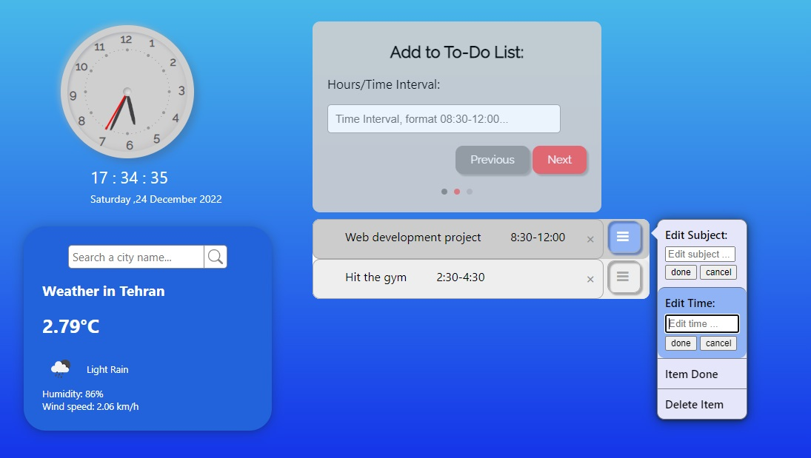

# Task List Creator & Editor + Analog Clock + Weather App ( V1 )

#### By _**Mahashi-github**_
#### Use this app to list/keep track of your tasks considering the time, date and weather conditions provided on the application.

#### This webapp includes: 
* An analog clock and date display.
* A weather app that receives the weather data of a city by name from an API.
* A task list creator and editor. 

## Technologies Used
* _html_
* _css_
* _vanilla javascript_  

## Setup
To run this project, open webApp.html in a browser. VScode's Live Server is recommended. 

## Notes 
This application receives weather data from https://api.openweathermap.org.

## Screenshot of the Application

  

